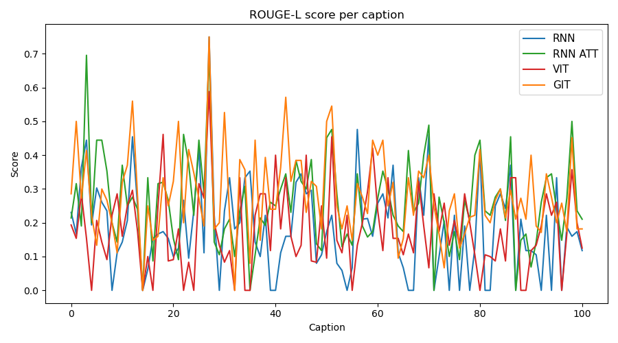
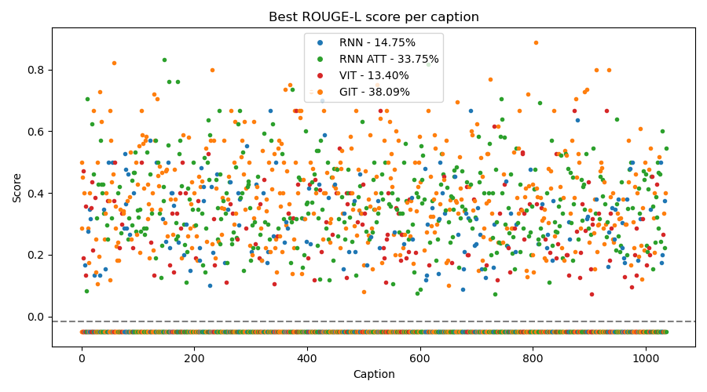

# Exploring Image Captioning with Different NN Models
This project explores various neural network architectures for image captioning. By leveraging the Flickr30k dataset, we analyzed and compared four models — Resnet50, LSTM, LSTM with attention mechanism, Vision Transformer with LSTM and the fine-tuned Microsoft's GIT. Our objective was to evaluate their effectiveness in generating accurate and descriptive captions for images.


## Table of Contents
- [Dataset](#dataset)
- [Models](#models)
- [Architecture Comparison](#architecture-comparison)
- [Results](#results)
- [Conclusion](#conclusion)
- [Web App](#web-app)
- [References](#references)
- [Contributors](#contributors)

## Dataset
We used the [Flickr30k dataset](https://www.kaggle.com/datasets/adityajn105/flickr30k), a popular benchmark for image captioning. The dataset consists of 30,000 images with five captions per image, describing various objects, actions, and scenes. It provides a well-rounded base for training and evaluating models due to the diverse image content; moreover, having multiple captions as referene allows robust training and evaluation phases. The split phase has been performed using the script [split.ipynb](./split.ipynb), allowing custom selection of partitions for training, validation and testing sets.

## Models
Model proposed are mainly based on an encoder-decoder architecture involving two main steps:
- **Encoding**: image features are extracted through a CNN to encode the image into fixed-length embedding vectors;
- **Decoding**: a RNN is typically employed as the decoder to generate a language description.

Here a detailed description of each model:

1. **ResNet50 and RNN with LSTM**: 
    - encoder: ResNet50 and Glove 100 dim for word embeddings;
    - decoder: standard LSTM, for its ability to capture long--term dependencies and sequential patterns in text.
   
2. **ResNet50 and RNN with LSTM and Attention mechanism**: 
    - encoder: ResNet50 and Glove 100 dim for word embeddings
    - decoder: LSTM with Attention mechanism, which allows the model to dynamically attend to different parts of the image and then use this information to generate meaningful and contextually relevant captions.
   
3. **Vision Transformer (ViT) and RNN with LSTM**: 
    - encoder: Vision Transformer Glove 200 dim for word embeddings; ViT divides the input image into patches tokens, each of which is passed through a multi-layer transformer, which uses self-attention to capture both local and global relationships between patches;
    - decoder: standard LSTM Cell
   
4. **Microsoft’s Generative Image–To–Text (GIT)**: this last architecture involves a fine-tuned GIT, that is used as benchmark to evaluate the quality of captions generarted by custom models above.

## Training and Validation
Each of the architectures presented required a custom training function, tailored to address the unique characteristics of the respective models. **Cross-Entropy Loss** was implemented as the loss function for all custom models.

Here we propose four parameters for prior evaluation:

| **Model**  | **Epochs** | **Train. Time** | **Train. Loss** | **Val. Loss** |
|-|:-:|:-:|:-:|:-:|
| Rn + RNN        | 10 | 43 min  | ~2.24 | ~2.95  |
| Rn + RNN & Att  | 10 | 117 min | ~2.49 | ~3.25  |
| ViT + RNN       | 10 | 150 min | ~2.38 | ~2.91  |
| Microsoft GIT   | 3  | 15 hr   | ~0.05 |   —    |


## Results

Our analysis involved evaluating each model based on BLEU, ROUGE-1, ROUGE-2, ROUGE-L scores and other standard image captioning metrics.

Since the trend of the metrics curves is very messy and does not provide any notable information, we propose the percentage of models that perform best in each metric. As reference, we propose also plots related to the ROUGE-L metric both for the best performing model (with the cumulative line in the bottom) and their trend.


| **Model**  | **BLEU**  | **ROUGE-1** | **ROUGE-2** | **ROUGE-L** |
|:-:|:-:|:-:|:-:|:-:|
| Rn + RNN        | 17.26% | 15.72% | 34.14% | 14.75%  |
| Rn + RNN & Att  | 32.21% | 29.41% | 24.20% | 33.75%  |
| ViT + RNN       | 12.83% | 14.46% | 10.13% | 13.40%  |
| Microsoft GIT   | 37.70% | 40.41% | 31.53% | 38.09%  |




## Conclusion
There is no single best-performing model; each proposed model has its own strengths and performs better depending on the type of features captured in the image, how it generates the caption, and how well the reference caption actually matches the image. This situation can generally be addressed by choosing the best caption from the model that achieves the highest sum across all metrics:

$$
m = \arg \max_{m \in \text{Models}} \sum_{i \in \text{Metrics}} \text{Score}(m, i)
$$

However, human observation could still lead to a different result due to the complexity of the task.


## Web App
To launch web app in local hosting, you need to install proper requirements and get all models able to produce outcomes from each one; then the following script from root directory:
```sh
python3 web_app/app.py
```


## References

- [Flickr30k Dataset](https://www.kaggle.com/datasets/adityajn105/flickr30k)
- [GloVe](https://aclanthology.org/D14-1162.pdf)
- [ResNet](https://ieeexplore.ieee.org/stamp/stamp.jsp?tp=&arnumber=9687944)
- [Microsoft's GIT](https://arxiv.org/abs/2205.14100)
- [Vision Tranformer](https://ieeexplore.ieee.org/document/9784827)
- [Evaluation metrics](https://doi.org/10.1049/ipr2.12367)


## Contributors

- [whiitex](https://github.com/whiitex) 🦍
- [Tiazzo](https://github.com/Tiazzo)